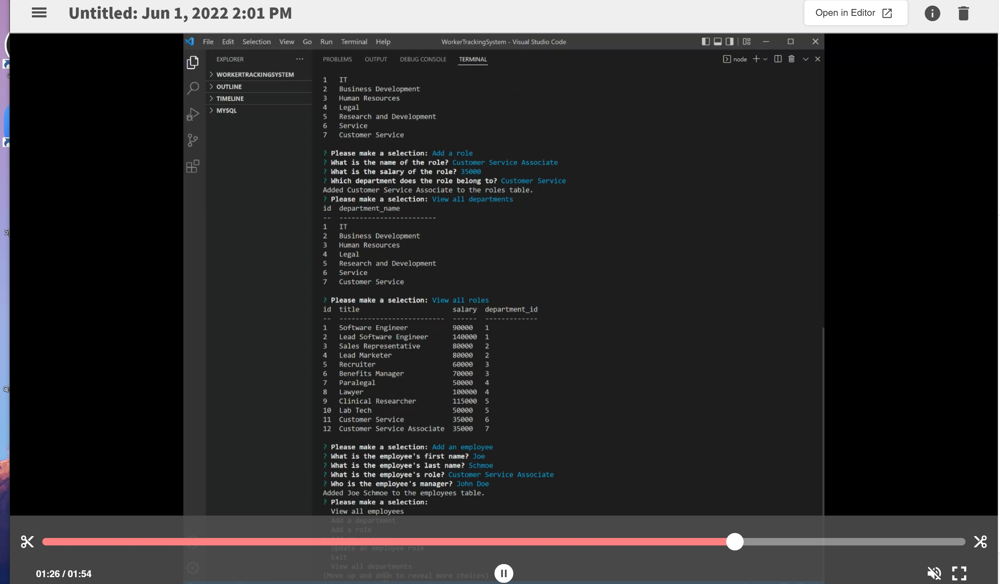

# WorkerTrackingSystem
Week 12: Employee Management System

## Description
A command-line app that allows viewing and updating a company database that includes company departments, departmental roles, and individual employees.

## Table of Contents
* [Installation](#installation)
* [Usage](#usage)
* [Technologies](#technologies)
* [License](#license)
* [Contact](#contact)

## Installation
Clone the repo and install all dependencies.

## Usage
Run the server.js file in your terminal and follow all prompts. Use your arrow keys to tab through options.

See video for a *[walkthrough](https://drive.google.com/file/d/1Sj3dsuMbg56rVWI-jGs4-8VRrDM55WWB/view)*.

## Technologies
- MySQL
- Javascript
- Inquirer 

## License

---
### Contact
CTidwell106@gmail.com
